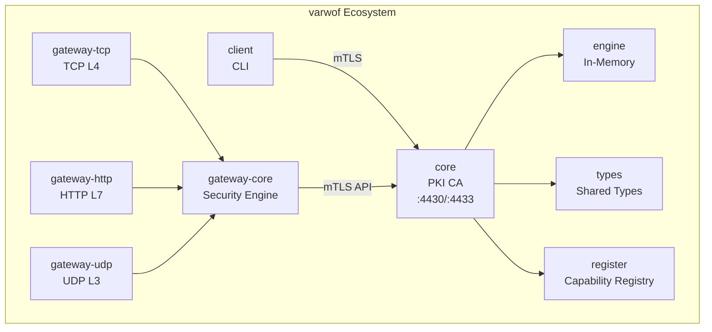

# Varwof PKI

> ⚠️ **Technical Preview** — Core cryptographic primitives verified for OpenSSL interoperability; RFC compliance ongoing.
> **Not for production use.** APIs and features may change before official release.

[](LICENSE)
[](https://go.dev)
[](https://pkg.go.dev/github.com/varwof/core)
[](https://github.com/varwof/core/actions)

**Single binary, pure Go, private CA up in one minute.**

[中文](README_CN.md)

> **Pure Go**: all features implemented in pure Go, no external dependencies.
> **System Requirements**: none. Just a single Go-compiled binary.
> **Target Users**: individual developers, small teams, K8s dev clusters.

**Language**: Go 1.26 — **Database**: SQLite (recommended, pure Go)

---

## Features

| Category | Capabilities |
|----------|-------------|
| **CA** | init-ca (root/sub), ca-list, ca-info, sub-ca create |
| **Issue** | CSR or auto keygen, 9 profiles, batch CSV, renew |
| **Revoke** | CLI revocation, OCSP real-time, CRL generation |
| **TSA** | RFC 3161 timestamp |
| **OCSP** | RFC 6960 responder |
| **Code sign** | PKCS#7 detached/embedded, CAdES-T, verify |
| **Cross-cert** | Cross-certificate issue/list/revoke |
| **Trust bridge** | Cross-sign CA, federate trust anchors |
| **Multi-DB** | SQLite (recommended), PostgreSQL, MySQL/MariaDB |
| **RBAC** | Users (4 roles), API tokens, audit log |
| **REST API** | JSON API for all operations |
| **Health** | `/healthz`, `/readyz` endpoints |

## Performance

| Metric | Result |
|---|---|
| Signing throughput | ~11,000 req/s (signing-bound ceiling) |
| Enterprise workload | 833 AIC/s sustained, p99 **5 ms**, ~800 MB stable RAM, no backpressure, no 503 |

Full benchmark reports: [Bench & Test](docs/bench/README.md).

## Quick Start

```bash
go build -o /usr/local/bin/varwof ./cmd/pki/

varwof init-ca --name root --profile root-ca --out-dir /etc/varwof/core/root
varwof init-ca --name issuing --profile sub-ca \
  --parent root --parent-key /etc/varwof/core/root/private/ca.key

varwof serve

varwof issue --cn server.example.com \
  --san "DNS:server.example.com,IP:10.0.0.1" \
  --profile tls-server --out-dir /etc/varwof/core/certs
```

## Installation

```bash
go build -o /usr/local/bin/varwof ./cmd/pki/
```

## Architecture



## Documentation

| Document | EN | CN |
|---|---|---|
| Quick Start | [`docs/core/en/quickstart.md`](docs/core/en/quickstart.md) | [`docs/core/zh/quickstart.md`](docs/core/zh/quickstart.md) |
| Configuration | [`docs/core/en/configuration.md`](docs/core/en/configuration.md) | [`docs/core/zh/configuration.md`](docs/core/zh/configuration.md) |
| Deployment | [`docs/core/en/deployment.md`](docs/core/en/deployment.md) | [`docs/core/zh/deployment.md`](docs/core/zh/deployment.md) |
| Commands | [`docs/core/en/commands.md`](docs/core/en/commands.md) | [`docs/core/zh/commands.md`](docs/core/zh/commands.md) |
| API Reference | [`docs/core/en/api.md`](docs/core/en/api.md) | [`docs/core/zh/api.md`](docs/core/zh/api.md) |
| OpenAPI Spec | [`docs/openapi.yaml`](docs/openapi.yaml) | — |
| Bench & Performance | [`docs/bench/README.md`](docs/bench/README.md) | [`docs/bench/README_CN.md`](docs/bench/README_CN.md) |

core is the **core CA engine** of the varwof ecosystem, providing complete PKI lifecycle management. This project is a member of the [Open Invention Network](https://openinventionnetwork.com/).

## Links

| | |
|---|---|
| Homepage | https://varwof.com |
| Community | https://varwof.org |
| IETF Draft | [draft-wei-aic-identity-cert](https://datatracker.ietf.org/doc/draft-wei-aic-identity-cert/) |
| License | AGPL-3.0 |
| Member | [Open Invention Network](https://openinventionnetwork.com/) |

## Community

Questions, feedback, and port status: [AIC Discussions](https://github.com/varwof/aic-jwt/discussions)
